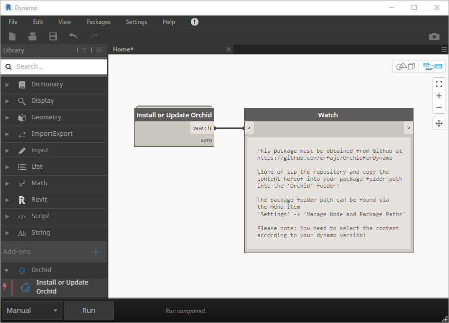

# Orchid  
Orchid is a solution designed for use in the [Dynamo](http://dynamobim.org) environment. The solution is designed to support practical, technical, logical, and mathematical issues. In particular, is the solution designed to handle nD-list issues. In addition, are solutions for applications included in the BIM wheel supported, which not necessarily are Autodesk products.  
  
**Software environment:** Built for Dynamo +1.3.2, +2.0.1 and Revit +2017  
  
**Orchid Dictionary:**  
In the <a href="https://erfajo.github.io/dictionary/index.html" target="_blank">dictionary</a> is nodes in the Ochid package described.  
  
**Orchid Samples:**  
In the [Samples](Samples) folder can samples using the Orchid package be found. For further informations read the [Readme](Samples/readme.md) file!  
  
**History/Change Log:**  
<a href="Orchid_130.md">Orchid 1.3.x</a>  
<a href="Orchid_200.md">Orchid 2.0.x</a>  
  
---
### Install or Update in Dynamo  
Use the executable installer in the [Builds](Builds) folder to install the Orchid package.  
Select the installer according to your dynamo version!  

REVIT AND DYNAMO MUST BE CLOSED DURING INSTALLATION!  

The Orchid package may also be installed by manually copying files from the repository. This is only recommendable for experienced users! To install/update this way, please copy the content of the chosen version into your package folder path into the 'Orchid' folder! Download is handled by either cloning or zipping the repository. The package folder path can be found in Dynamo via the menu item 'Settings' -> 'Manage Node and Package Paths'.  

Select the content according to your dynamo version!  
<pre>
OrchidForDynamo
├── Orchid_130    (for the dynamo 1.3.x branch)  
└── Orchid_200    (for the dynamo 2.0.x branch)  
</pre>

In case of installation from inside Dynamo or the Dynamo package manager site (<a href="https://dynamopackages.com" target="_blank">dynamopackages.com</a>), then only one node is available. This node will give the instruction and open this GitHub repository site for the user in a web browser.  

  

---
### License  
Copyright(c) 2014  
Erik Falck Jørgensen  
  
All content in this repository is part of the Orchid package.  
  
  
  
This work is licensed under the <a rel="license" href="http://creativecommons.org/licenses/by-nd/4.0/">
Creative Commons Attribution-NoDerivatives 4.0 International License</a> (CC BY-ND 4.0).  
  
In short terms does the CC BY-ND license state: This license allows for redistribution, commercial and non-commercial, as long as it is passed along unchanged and in whole, with credit to the author.  
