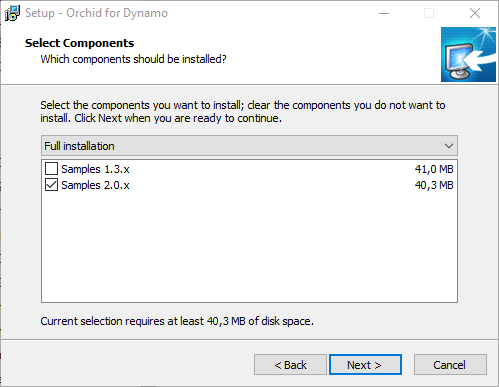
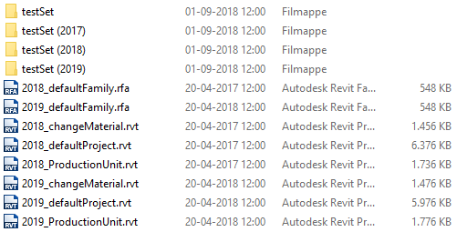

# Orchid Samples  
The sample files are roughly my testbed, I have more testing files to run the graphs on, but 95% of the tests can be done using the shipped Revit files in the sample collection. The graphs include all the nodes I have built for some kind of computed process. It is those graphs I am using to test my nodes if I do something new or need to re-code something due to Revit or Dynamo updates.  
  
## Installation of Samples
Please clone the sample files in this folder to use them. The sample files are also available as an executable installer (in the Builds folder) and will be installed in the "user document" folder named "Orchid Samples".  

  

To use these sample files, please open one of the Revit documents in the "Data" folder. By doing this the "root" directory will be set correctly in all the graphs!  

  
